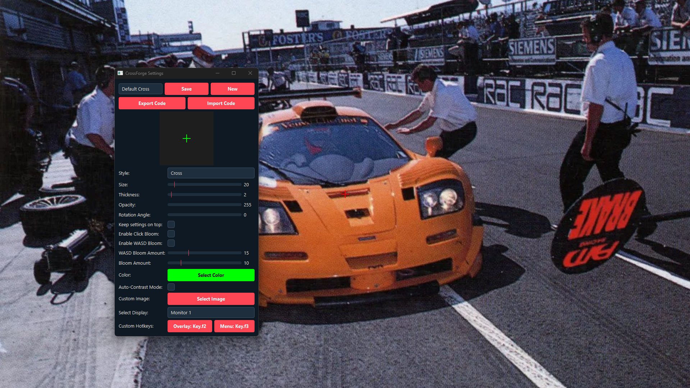

# CrossForge 🎯

I built CrossForge because I was tired of crosshair overlays that cause input lag or don't feel like they're actually part of the game. This is a custom crosshair overlay built in Python (PyQt6) that uses direct hardware polling to track your mouse and keyboard with zero delay.

## Features
- **WASD Movement Bloom:** The crosshair actually expands when you run (holding W/A/S/D) and shrinks when you stop, just like in CS2 or Valorant.
- **Click Bloom:** Expands when you shoot (left click).
- **Smart Colors:** Samples the center of your screen to auto-invert the crosshair color so you never lose it against bright skies or dark corners.
- **Custom Hotkeys:** Rebind the toggle keys to whatever you want.
- **Share Codes:** You can copy a short text string to export/import your crosshair settings with friends.
- **Multi-Monitor:** Works on any screen, you just pick your monitor from the dropdown.

## How to run it (Windows 64-bit)
Since this is a Python desktop app, I compiled it into a standalone Windows `.exe` so reviewers don't have to install Python or pip dependencies to test it. 

1. Go to the **Releases** tab on the right side of this GitHub repo.
2. Download `CrossForge-Windows.zip` and extract the folder.
3. Because I compiled this myself, Windows Defender SmartScreen might pop up and block it. If it does, just click **"More info"** -> **"Run anyway"**.
4. Double-click `CrossForge.exe` (or `main.exe`) to run it!
5. Press `F2` to toggle the crosshair and `F3` to open the settings menu.

## How to build it from source
If you are on Mac/Linux or just want to run the raw Python files:
1. Clone the repo
2. Install the requirements: `pip install -r requirements.txt`
3. Run `python main.py`

## AI Usage
AI helped me fix some weird UI CSS bugs and explain Windows memory hooks, but the core logic is all me. Definitely under the 30% rule!